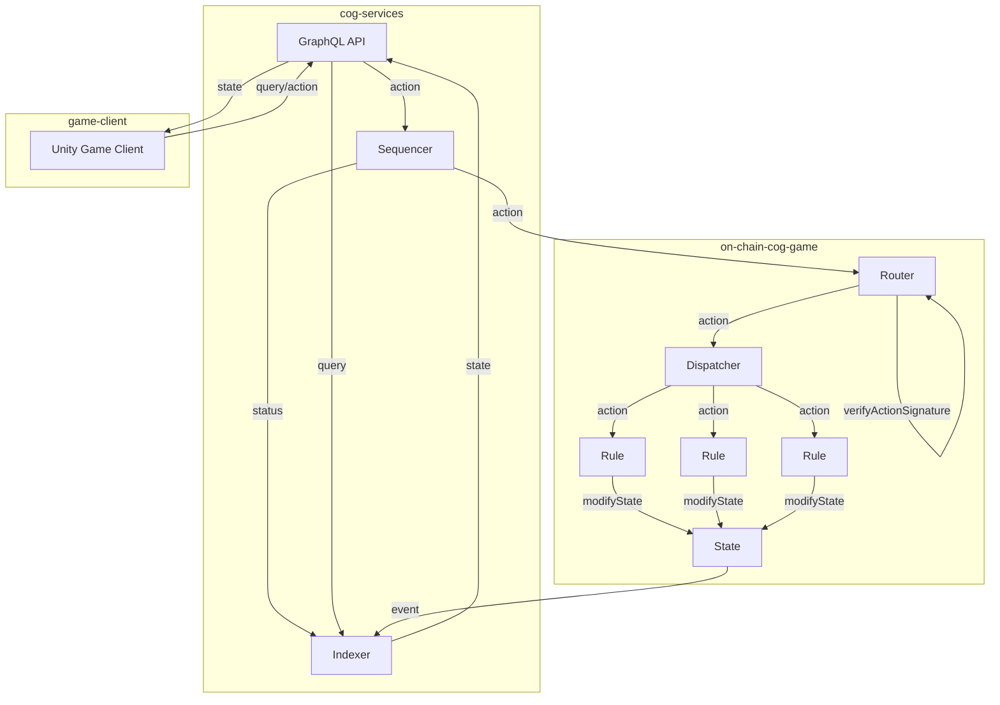

# cog-services

## Overview

Auxillary services supporting the games built with [cog](https://github.com/playmint/cog).

* API - GraphQL endpoint for displaying Indexer data
* Sequencer - Queues and submits player signed actions to chain
* Indexer - Fast cache of game state from chain
* Tests - Integration test running against [cog-examples](https://github.com/playmint/cog-examples)



## Quickstart

Use Docker Compose to provision a local instance of cog-services.

```
docker-compose up --build
```

To run the integration tests against the local deployment:

```
docker compose --profile=test up --build --exit-code-from cog-tests
```


